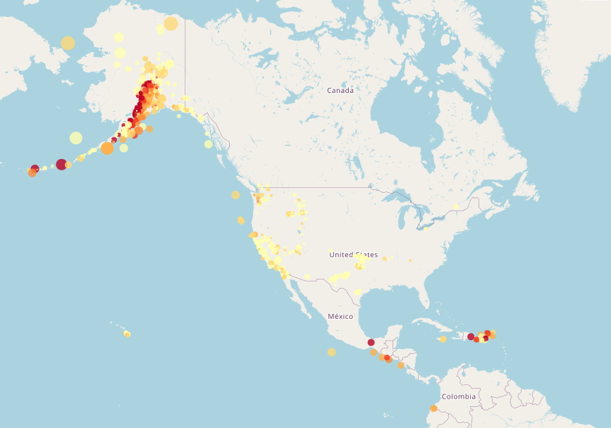

# Leaflet Challenge

## Module 15 Challenge

## Overview
The attached repository includes code used to develop an interactive map of earthquake data from the United States Geological Survey. Using the JavaScript Leaflet library, the USGS API is called and markers for each GeoJSON earthquake feature are constructed, with size (via radius) based on magnitude of the earthquake and color based on the depth of the earthquake. Deeper epicenters correspond to darker colors, while the shallowest earthquakes are signified by light yellow circles. This information is also presented in the attached legend.  

The map generated by the HTML in Leaflet-Part-1 includes both topographic and street-map layers, which can be toggled between using the menu in the top left corner of the map. At this time Leaflet-Part-2 has not been updated to included extended functionality. 

## Outside Resources

The code seen here was developed without the assistance of TAs, instructors, or peers other than the use of pieces of code from in-class activities and the provided starter HTML and CSS code. I also consulted Stack Overflow for how to add color boxes to my legend. 

## References
Dataset created by the [United States Geological Survey](http://earthquake.usgs.gov/earthquakes/feed/v1.0/geojson.php).
